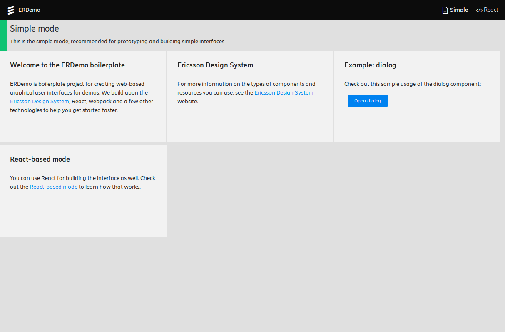

# ERDemo

ERDemo is a boilerplate project for building REST APIs and user interfaces for
public demos. It provides a quick and easy way to get started with
[Flask](http://flask.pocoo.org/),
[React](https://reactjs.org/),
[webpack](https://webpack.js.org/) and the
[Ericsson Design System](https://eds.rxn.us/), so you can get over the boring
setup focus on your demo. You'll still need to learn these tools to be able to
use this boilerplate, but it'll save you quite some time in integration and
setup effort.

## Installation and initial setup

Before using the ERDemo boilerplater, you will need Python 3, venv, and NodeJS
8+. For Ubuntu 16.04, the following can help you get started (make sure to get
the latest NodeJS 8+, and not necessarily the one listed below):

    sudo apt-get install python3 python3-pip python3-venv
    wget https://nodejs.org/dist/v8.11.1/node-v8.11.1-linux-x64.tar.xz
    tar xJvf node-v8.11.1-linux-x64.tar.xz
    mv node-v8.11.1-linux-x64 ~/node
    echo "export PATH=\$PATH:$HOME/node/bin" >> ~/.bashrc

The boilerplate is controlled by the `erdemo` script. To get started, run:

    ./erdemo init

This will download all the dependencies required for the build process and
create a Python virtual environment for the example server. ERDemo works with 
EDS v1.3. Since there are no URLs for downloading specific versions of EDS yet, 
if you see something break, it may be because a newer version of EDS was 
released.

After the initialization step is finished, build the web application:

    ./erdemo build

And then start the server:

    ./erdemo serve

And open the application in your browser:
[http://localhost:8080](http://localhost:8080)

The application itself will walk you through the overall architecture and
features.

## Customizing ERDemo

ERDemo is structured upon the concept of **modes**. Each mode is an entirely
independent part of the application. This is a typical pattern in demos: you
want to show a few things, and then move on to another interface to explain
another or show another related concept. It also eases the development of demos
in larger teams, requiring less coordination effort and less blaming due to
someone-broke-my-part-syndrome.

Each mode has its own CSS/[LESS](http://lesscss.org/) file
(`webui/css/[mode].less`), its own  JavaScript main module
(`webui/js/[mode].less`) and some initialization code in `webui/www/index.html`.
As for JavaScript, feel free to use the full power of modern versions of the
language, since demos usually don't care for old browsers :)

There's a master mode, the `erdemo` mode, which contains infrastructure code
shared by all other modes (e.g.: global imports, favicons, page title, etc).
The `index.html` file is considered part of this mode, though it also contains
a little bit of code from other modes.

In this boilerplate, there are two sample modes in addition to the master mode:
`simple` and `react`. For more information about them, open the web application
in your browser as shown above.

To get a grasp of how things are structured, take a look at `index.hml` and
`erdemo.js`. Then feel free to modify anything, it's your project after all!

When modifying the code, this will be your typical workflow:

1. If the server is running, stop it (CTRL+C), and then build again:

        ./erdemo build

2. And if the build is successful, start the server again:

        ./erdemo serve

Once you fork ERDemo to start your project, you usually won't keep it up-to-date
with mainstream. That's usually not a problem for demos, but can be troublesome
for bigger projects. This is an unfortunate consequence of using boilerplates:
you customize the boilerplate code, rather than extending it as you would when
using a framework. After you modify it, the child is yours to take care of :)

To customize the HTTP server behind ERDemo, edit the `server.py` file. You'll
most likely be interested in changing the `ERDemoAPI` class to implement REST
methods for your application. Checkout the
[Flask documentation](http://flask.pocoo.org/docs/1.0/) to learn more.

## ToDO

- Extract all modes from `index.html` into separate files and load them on
demand
- Improve documentation
- Automatically rebuild the WebUI when it changes
